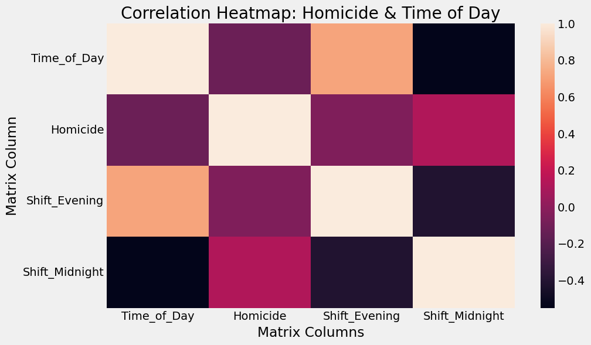
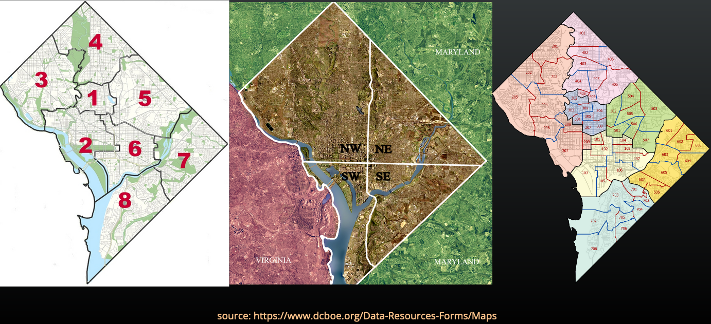
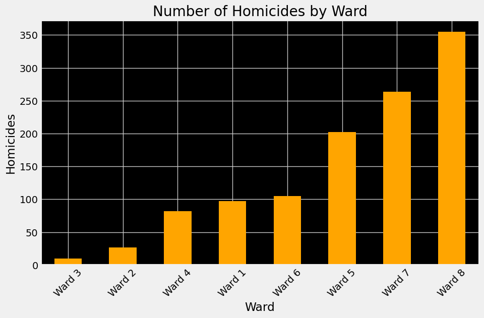
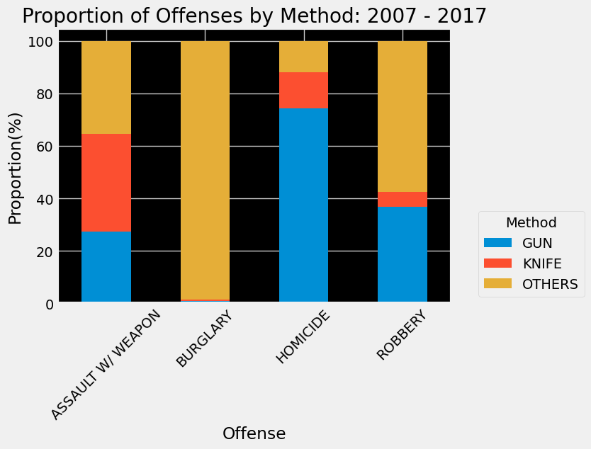
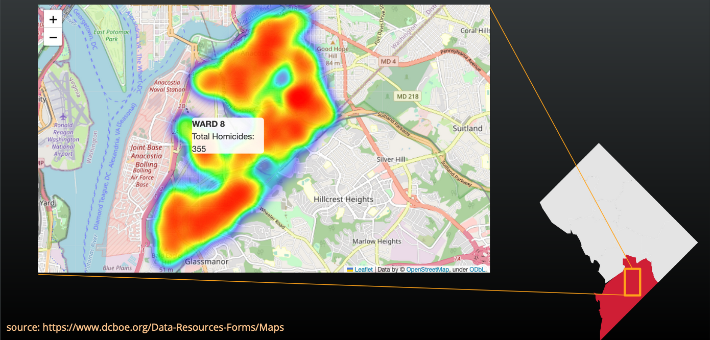
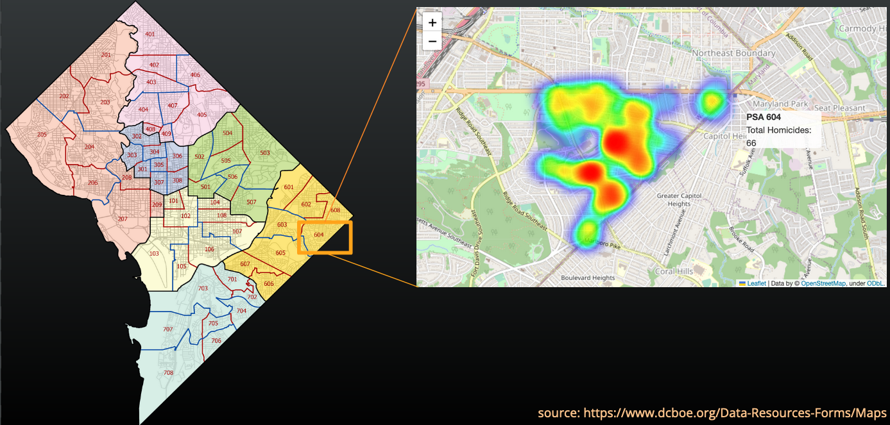

# DC Metro Crime Data: 2007 - 2017

Student: Joel P Himes

Link to presentation: https://docs.google.com/presentation/d/1yTNIoOccbnXvjyQK4LZHk1jPu5XbR-Ccz35EOF-j0ek/edit?usp=sharing 

# Project Goals
- Is there any correlation between the time of the day and the occurrence of homicides?

- Have homicides increased over this decade?

- Which voting wards had the highest number of homicides?

- Are homicides more likely to occur with a gun or a knife?

- Which ward & police service area has had the highest number of homicides over this timeframe?

# Benefit of Exploratory Data Analysis
- DC ranked in the top 10 of homicides per 100k citizens over the last 20 years.\
(source: https://www.macrotrends.net/states/district-of-columbia/murder-homicide-rate-statistics)

- Resource allocation and planning for the sustainment of combating homicide.

- Community engagement and collaboration, arming the police force with data-driven decisions for the community.

- Targeted law enforcement strategies.

- Evaluation of crime reduction initiatives.

# Describing the Dataset
- Dataset has 325340 rows consisting of 30 columns.

- Interesting Features:\
  ‘REPORT_DAT': dtype(‘O’)\
  ‘SHIFT': dtype('O')\
  'OFFENSE': dtype('O')\
  'METHOD': dtype('O')\
  'BLOCK': dtype('O')\
  'DISTRICT': dtype('float64')\
  'WARD': dtype('int64')\
  'NEIGHBORHOOD_CLUSTER': dtype('O')\
  'BLOCK_GROUP': dtype('O')\
  'VOTING_PRECINCT': dtype('O')\
  'START_DATE': dtype('O')\
  'END_DATE': dtype('O')\
  'XBLOCK': dtype('float64')\
  ’YBLOCK': dtype('float64')\
  'year': dtype('int64')\
  'crimetype': dtype(‘O’)

- Categorization of Features:\
  Object/String for most of the dataset.\
  Boolean for optional data.\
  Float64 for coordinates.\
  Int64 for date breakdown.

- Missing Data:\
  Really spread to a couple of columns across the data set, reaching roughly 19k out of 343k (less than 5% of the dataset).\
  Resulting in 17k rows removed with a new column count of 325340.\
  Mostly coming from NEIGH_CLUSTER or END_DATE.

- Relation of Features:\
  Found a strong relationship of features for most of the columns, excluding some of the coordinate-based and time-based columns.\
  Analysis of the dataset showed a weak (at best) correlation between Time_of_Day, Homicide, and Shift.\
  This was the case even with skewing the results favoring the ‘Evening / Midnight Shift.'

# Is there any correlation between the time of the day and the occurrence of homicides?

Let's address our first question: Is there any correlation between the time of day and the occurrence of homicides? After analyzing the dataset, I found a weak correlation, at best, between time of day, homicides, and shift. This was the case even when favoring the 'Evening/Midnight Shift.' Therefore, we can conclude that the time of day over the last decade does not significantly impact the occurrence of homicides.

# Have homicides increased over this decade?

Moving on to our second question: Have homicides increased over this decade? The dataset suggests fluctuations in homicides over the years, indicating that some policing initiatives may have worked at certain times over the last decade. However, it is essential to note that this dataset covers a specific period from up to 2017, and further analysis beyond this timeframe is required to draw definitive conclusions about long-term trends.

# Lay of the Land: 8 Wards, 7 Districts, and 57 PSAs.

This slide is just a quick refresher for some or a quick intro for others regarding the “Lay of the Land” in terms of how DC is broken out. Smack dab in between Maryland and VA.
-	8 voting Wards (shown on the left).
-	7 Police Districts (the zoning is a hair different as compared to the wards).
-	With 57 Police Service Areas (shown on the right).

# Which wards or neighborhoods had the highest number of homicides?

Let's explore our third question: Which wards or neighborhoods had the highest number of homicides? According to the data, Ward 8 of Police District 7 in the Southeastern (SE) corridor had the highest number of homicides. Accounting for 355 homicides over the last decade. 

# Are homicides more likely to occur with a gun or a knife?

Now, let's address the fourth question: Are homicides more likely to occur with a gun or a knife? Comparing the data, we found that homicides were committed roughly 75% of the time with a gun, as opposed to other methods, over the specified decade. 

# Which ward & police service area has had the highest number of homicides over the last decade?

Based on the dataset, Ward 8 emerged as the ward with the highest number of homicides – further proving our point in the stacked bar chart. 

Additionally, PSA 604 of Police District 6 recorded the highest number of homicides.
  

This shows that Ward 8 had more homicides over a spread-out area during the specified decade (roughly 9 square miles), while PSA 604 in Capital Heights DC/MD had more murders per square mile than any other PSA (3 square miles).
- Source(https://censusreporter.org/profiles/61000US11008-ward-8-dc/) 
- Source(https://mpdc.dc.gov/sites/default/files/dc/sites/mpdc/publication/attachments/PSA%20604%20Map%2024x24.pdf)

# Contact Information

Student: Joel P Himes\
\
GitHub: Joel H\
\
Email: himejoel2107@gmail.com\
\
Link to Repo: https://github.com/joelphimes/DC-Metro-Crime-Data-2007---2017 \
\
Link to Dataset: https://www.kaggle.com/datasets/vinchinzu/dc-metro-crime-data
